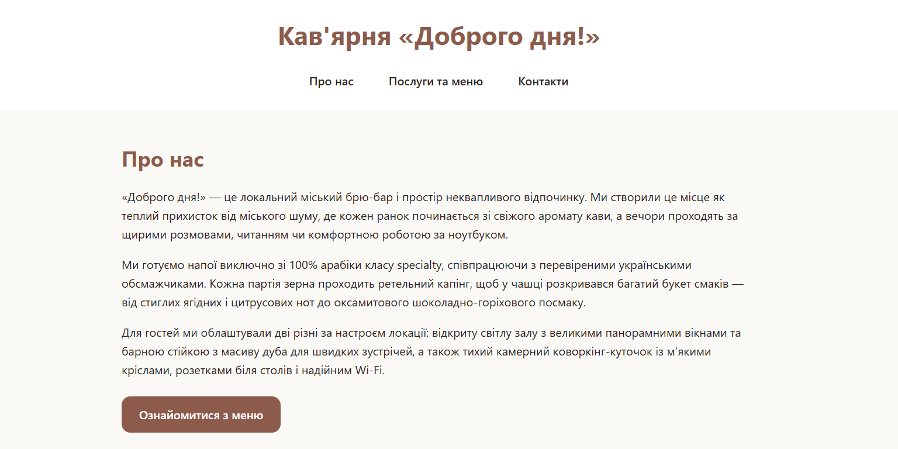
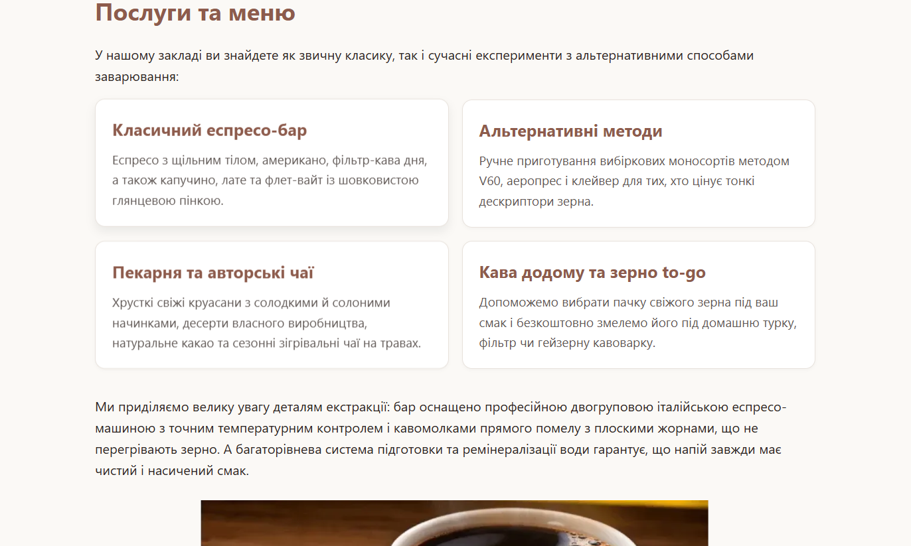
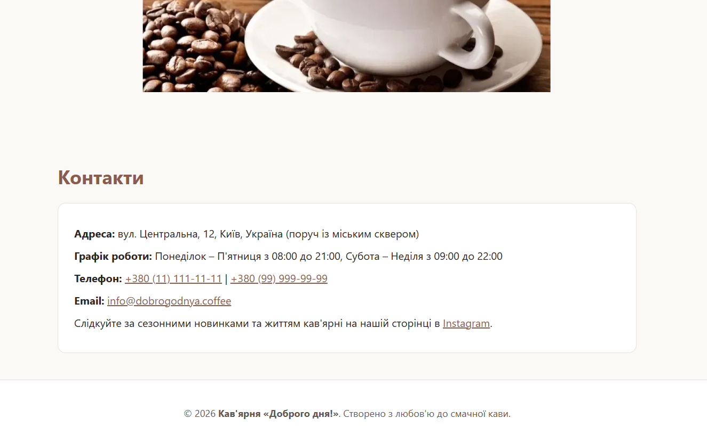

# Лабораторна робота №2. Стилізація веб-сторінки засобами CSS

## Тема, мета та опис проєкту

- **Тема:** Підключення каскадних таблиць стилів і базове оформлення HTML-сторінки наскрізного навчального проєкту.
- **Мета:** Навчитися підключати зовнішній CSS-файл, добирати селектори, застосовувати каскад та успадкування, використовувати модель коробки і CSS-змінні, оформлювати типографіку, навігацію, кнопки та картки контенту.
- **Опис проєкту:** Продовження розробки вебсайту для кав'ярні «Доброго дня!». Для сторінки створено єдину систему стилізації з кавовою палітрою, налаштовано модель коробки, оформлено картки послуг та меню, реалізовано інтерактивні стани для кнопок і посилань для покращення доступності.

## Реалізовані зміни

1. **Зовнішній CSS:** Створено каталог `css/` та файл `styles.css`, підключений через тег `<link>` у секції `<head>`.
2. **CSS-змінні (`:root`):** Оголошено систему змінних для палітри (`--color-primary`, `--color-primary-hover`, `--color-text`, `--color-text-muted`, `--color-background`, `--color-surface`, `--color-border`, `--color-focus`), а також просторових параметрів (`--space`, `--radius`).
3. **Модель коробки та скидання:** Застосовано `box-sizing: border-box` для всіх елементів, базові налаштування шрифту та інтервалів для `body`, гнучкі зображення (`max-width: 100%; height: auto;`).
4. **Оформлення карток:** Створено 4 уніфіковані картки на базі класу `.card` із використанням внутрішніх відступів, меж, заокруглень та ефекту підняття з тінню при наведенні.
5. **Інтерактивні стани (доступність):** Налаштовано псевдокласи `:hover` та `:focus-visible` для навігаційних посилань, кнопок і контактів без відключення контуру фокусу для користувачів клавіатури.

## Структура проєкту

- css/
  - styles.css
- images/
  - cafe.jfif
  - cup of coffee.png
  - screenshot-cards.png
  - screenshot-contacts.png
  - screenshot-header.png
- index.html
- README.md

## Результат

### 1. Шапка сайту та головний екран

### 2. Меню та картки послуг

### 3. Контактна інформація та підвал

## Посилання та висновок

- **Pull Request:** [lab-2-css PR]()
- **Висновок:** Під час виконання другої лабораторної роботи підключив зовнішню таблицю стилів до сторінки кав'ярні, налаштував модель коробки за допомогою box-sizing та виніс кольори й відступи у змінні :root. Також стилізував картки для меню, посилання в навігації та кнопку, додавши стани hover та focus-visible для зручності керування з клавіатури.
